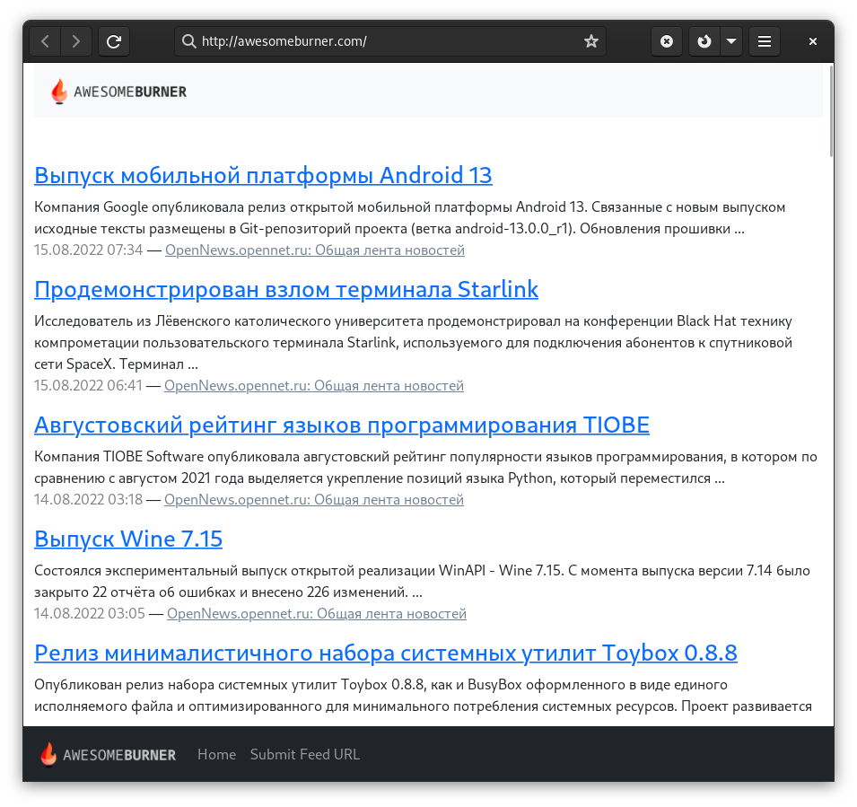

# NewArggregator

Who uses:

- [AwesomeBurner.com](http://awesomeBurner.com)

## Install

1. Install composer

`$ curl -sS https://getcomposer.org/installer | php`

2. Install dependencies

`$ php composer.phar install`

`cp WEB-INC/conf.php.origin WEB-INC/conf.php`

# API

## RSS

Добавление новой RSS-ленты в БД

`$api->feed("add", array("url" => "http://www.ru/rss", "lang" => "en"));`

Удаление rss-ленты из БД

`$api->feed("delete", array("url" => "http://www.ru/rss"));`

Вывод статей определенной RSS-ленты

`$api->feed("get", array("feed_id" => 1, "page" => 1, "limit" => 20, "keyword" => array("one", "two")));`

## Статьи

`$api->feed("item_get", array("feed_id" => 1, "item_id" => 1));`

`$api->feed("item_delete", array("item_id" => 1));`

## Статистика

Вывод статистики

`$api->stats("get", null)`

## Паук

Сканирование всего списка лент.

`$api->crawler("all", null)`

Сканирование определенного количества RSS-лент

`$api->crawler("all", array("limit" => 10))`

## Поиск

`$api->search("keyword", array("limit" => 10, "page" => 1, "keyword" => array("news", "russia", "finance")))`

## Voting

`$api->vote("like_feed", array("feed_id" => 1))`

`$api->vote("like_item", array("item_id" => 1))`

`$api->vote("dislike_feed", array("feed_id" => 1))`

`$api->vote("dislike_item", array("item_id" => 1))`
